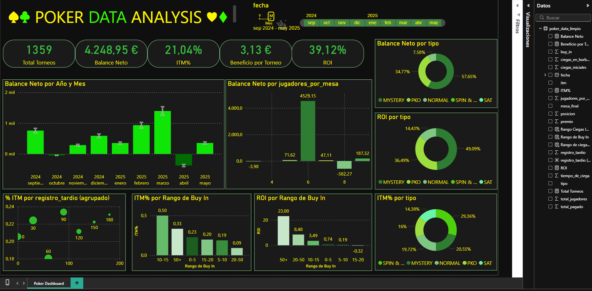

# Análisis de Resultados de Poker

Este proyecto implica el análisis de resultados personales de torneos de poker utilizando Python con pandas para la limpieza y preparación de datos, y la visualización de los indicadores clave de rendimiento en un dashboard de Power BI.

## Fuente de Datos

El análisis se basa en los datos de torneos de poker almacenados en el archivo `poker_data.csv`.

## Preparación de Datos (usando pandas)

El notebook de Jupyter `poker_analysis.ipynb` detalla los pasos realizados para limpiar y preparar los datos crudos para el análisis:

1.  **Carga de Datos:** Los datos se cargan desde el archivo `poker_data.csv` a un DataFrame de pandas.
2.  **Manejo de Columnas:**
    *   La columna 'NOMBRE DE TORNEO' se elimina ya que no es necesaria para el análisis.
    *   Los nombres de las columnas se estandarizan (por ejemplo, convirtiendo a snake_case y eliminando espacios extra) para facilitar el acceso.
3.  **Conversión de Tipos de Datos y Limpieza:**
    *   La 'FECHA' columna se convierte a formato datetime.
    *   Las columnas que contienen valores monetarios ('BUY IN', 'TOTAL PAGADO', 'PREMIO') se limpian eliminando símbolos de moneda y comas, y luego se convierten a formato numérico (float).
    *   La 'CIEGAS INICIALES' columna se limpia eliminando comas y se convierte a float. Los valores faltantes se rellenan utilizando la moda de la columna.
    *   Los valores faltantes de la columna 'REGISTRO TARDIO (MINS)' se rellenan utilizando la moda.
    *   La 'CIEGAS AL CIERRE DE BURBUJA' columna se limpia y se convierte a float. Los valores faltantes se manejan condicionalmente, rellenando con 0 si no se ganó premio, y con el segundo valor más frecuente si se ganó premio.
    *   Las columnas 'ITM' (In The Money) y 'Mesa Final' se convierten a tipos booleanos.
4.  **Formateo:** Las columnas numéricas que se convirtieron a float se redondean a dos decimales.
5.  **Guardar Datos Limpios:** Los datos procesados se guardan en un nuevo archivo CSV llamado `poker_data_limpio.csv`, formateado con coma como separador decimal para compatibilidad con Power BI.

## Dashboard de Power BI

El dashboard de Power BI, titulado "POKER DATA ANALYSIS", proporciona insights clave y visualizaciones basadas en los datos limpios:

*   **Métricas Clave:** Muestra cifras destacadas como Total Torneos, Balance Neto, ITM% (Porcentaje In The Money), Beneficio por Torneo y ROI (Retorno de la Inversión).
*   **Rendimiento a lo Largo del Tiempo:** Un gráfico de barras muestra el desglose del Balance Neto por año y mes.
*   **Rendimiento por Tamaño de Mesa:** Visualiza el Balance Neto basado en el número de jugadores por mesa.
*   **Rendimiento por Tipo de Torneo:** Gráficos de anillo ilustran la distribución del Balance Neto y el ROI en diferentes tipos de torneo (MYSTERY, PKO, NORMAL, SPIN & ..., SAT).
*   **Rendimiento por Nivel de Buy-in:** Gráficos de barras analizan el ITM% y el ROI categorizados por rangos de cantidades de Buy-in.
*   **ITM por Registro Tardío:** Un gráfico de burbujas explora la relación entre el ITM% y el tiempo de registro tardío.
*   **Filtros:** Incluye filtros interactivos, como un selector de fechas, para permitir a los usuarios explorar datos para períodos específicos.

## Archivos

*   `poker_data.csv`: El archivo de datos crudos original.
*   `poker_analysis.ipynb`: Notebook de Jupyter que contiene los pasos de limpieza y preparación de datos usando pandas.
*   `poker_data_limpio.csv`: Los datos limpios y procesados listos para la visualización.
*   `README.md`: Este archivo de resumen.

## Configuración

1.  Coloque su archivo de datos crudos como `poker_data.csv` en el directorio apropiado (según se referencia en el notebook, probablemente una carpeta `Data/`).
2.  Asegúrese de tener pandas instalado (`pip install pandas`).
3.  Ejecute el notebook `poker_analysis.ipynb` para realizar la limpieza de datos y generar `poker_data_limpio.csv`.
4.  Abra el archivo de Power BI asociado (no incluido en esta descripción pero referenciado por la imagen del dashboard) y conéctelo al archivo `poker_data_limpio.csv` para ver las visualizaciones.

